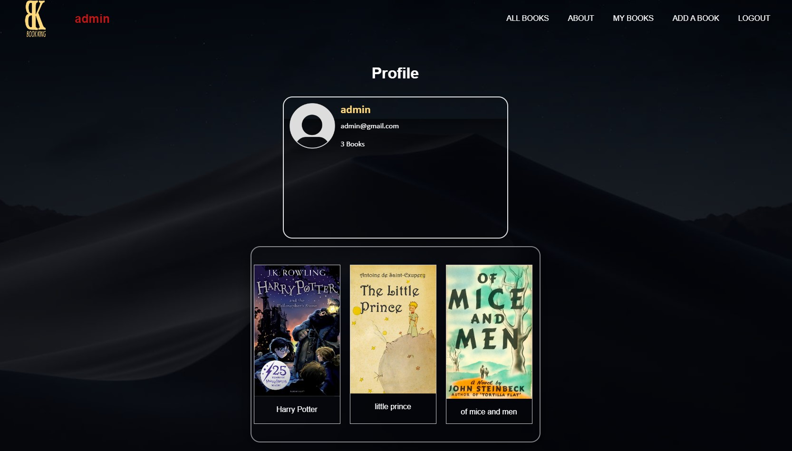

# JSReact-Book-King-Workshop-2023
Workshop/Project Build for My JavaScript React Course in SoftUni!

### Website for Reviewing and Commenting Books

## Description

This is a website for reviewing books. 
It is a project for the "React - Front- End" course at Software University.
The front end is written in React.
[SoftUni Practice Server](https://github.com/softuni-practice-server/softuni-practice-server) as a backend solution

## Local Installation

1. Clone the repository.
2. Run `npm install` in both the `book-king` and `server` folders.
3. Run `npm start` in the `book-king` folder.
4. Run `node server.js` in the `server` folder.
\
&nbsp;

## Built With
[](https://skillicons.dev)

\
&nbsp;

# React Sample Code　

```javascript
import createstyle from './createstyle.module.css';
import { useForm } from '../../hooks/useForm';
import { useBookContext } from '../../contexts/BookContext';

export const Create = () => {
    const {onCreateBookSubmit} = useBookContext();
     const {values, changeHandler, onSubmit} = useForm({
        title: '',
        imageUrl: '',
        author: '',
        price: '',
        description: ''
     }, onCreateBookSubmit);


    return (
        <div className={createstyle.wrapper}>
        
        
        <div className={createstyle.formbox}>
            <h2>Add a Book</h2>
            <form method='POST' onSubmit={onSubmit}>
                <div className={createstyle.inputbox}>
                    <p className={createstyle.icon}><ion-icon name="bookmark"></ion-icon></p>
                    <input value={values.title} onChange={changeHandler} name="title" type="text" required/>
                    <label>Title</label>
                </div>
                <div className={createstyle.inputbox}>
                    <p className={createstyle.icon}><ion-icon name="layers"></ion-icon></p>
                    <input value={values.imageUrl} onChange={changeHandler} name="imageUrl" type="text" required/>
                    <label>ImageUrl</label>
                </div>             
                    <div className={createstyle.inputbox}>
                        <p className={createstyle.icon}><ion-icon name="egg"></ion-icon></p>
                        <input value={values.author} onChange={changeHandler} name="author" type="text" required/>
                        <label>Author</label>
                    </div>
                    <div className={createstyle.inputbox}>
                    <p className={createstyle.icon}><ion-icon name="cash"></ion-icon></p>
                        <input value={values.price} onChange={changeHandler} name="price" type="number" min="1" required/>
                        <label>Price</label>
                    </div>
                    <div className={createstyle.inputbox}>
                    <p className={createstyle.icon}><ion-icon name="information-circle"></ion-icon></p>
                        <textarea value={values.description} onChange={changeHandler} name="description" id="viewarea" rows="5" cols="50" required/>
                        <label htmlFor="viewarea">Description</label>
                    </div>
                    <button type="submit" className={createstyle.btn}>Add a Book</button>
                    
                </form>
        </div>
    </div>
    )
}
```

\
&nbsp;

# Screenshots

### Home Page 


&nbsp;
### Books List


&nbsp;
### Profile Page



&nbsp;
### Create User


&nbsp;
